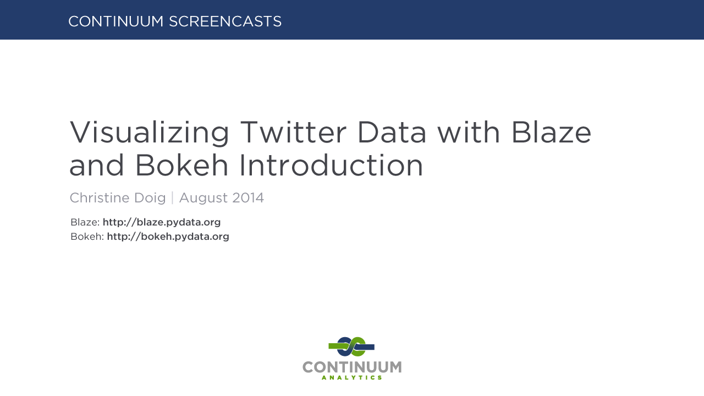
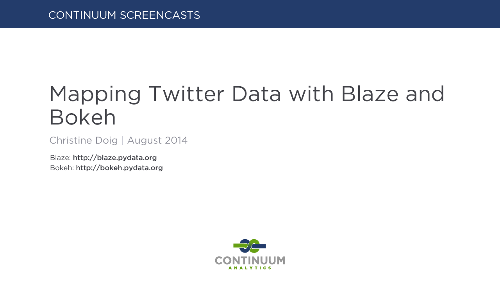

#XDATA Challenge Demos

##Twitter Dataset

This dataset was collected from February 2012 to May 2013. All collected tweets were sourced in Europe, the Middle East, Africa, Australia, and Asia. Some of the tweet records include high-fidelity geospatial information, resolved to lat-lon coordinates. In addition, translation, transliteration, sentiment, referenced tweets, mentioned user IDs, and other rich metadata are included in these records.

This demonstration contains the following examples:

#### [Visualizing Twitter Data with Blaze and Bokeh Introduction](./twitter/analysis)

> In this video we introduce you to using open-source Python libraries, Blaze and Bokeh, for analyzing Twitter data. By using publicly available data, we show you how to display data, such as tweet volume and top hashtag by date.

#### [Mapping Twitter Data with Blaze and Bokeh](./twitter/mapping)

> This video is follow up to the "Visualizing Twitter Data with Blaze and Bokeh Introduction" video. In this video, we plot tweets on a world map, show you how to filter by date and/or user, and how to display tweets on top of Google maps.

---

---

## Employment Dataset

This dataset consists of employment opportunities posted from http://www.computrabajo.com affiliate sites, which primarily serve Latin and South American countries. Employment records were scraped from each site once per day from November 2012 to December 2013, and each record includes fields such as `posted date`, `location`, `salary`, etc.

As expected, many of the fields contain Spanish text. The `translated location` field is run through a geocoding service to estimate a rough latitude and longitude, although many of the records have locations that could not be translated or geocoded properly.

This demonstration contains the following examples:

#### [Exploring Large Datasets with Blaze and Bokeh](./employment/exploration)

> This video shows a demonstration of using Blaze and Bokeh to explore a large dataset. A 40 GB set of text files is pre-processed with Blaze, then we compute over this data with Blaze again and visualize it with Bokeh, providing interactive plots in the browser.

#### [Data Ingest with Blaze](./employment/migration)

> In this video, we use Blaze to migrate data from text files to SQL databases, with a couple plots in Bokeh that track the progress of the transfer, and use Blaze to query the database for latitude-longitude values, and a world map of the same.