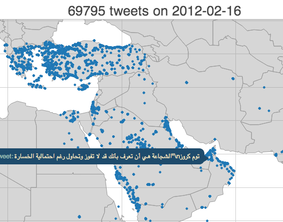
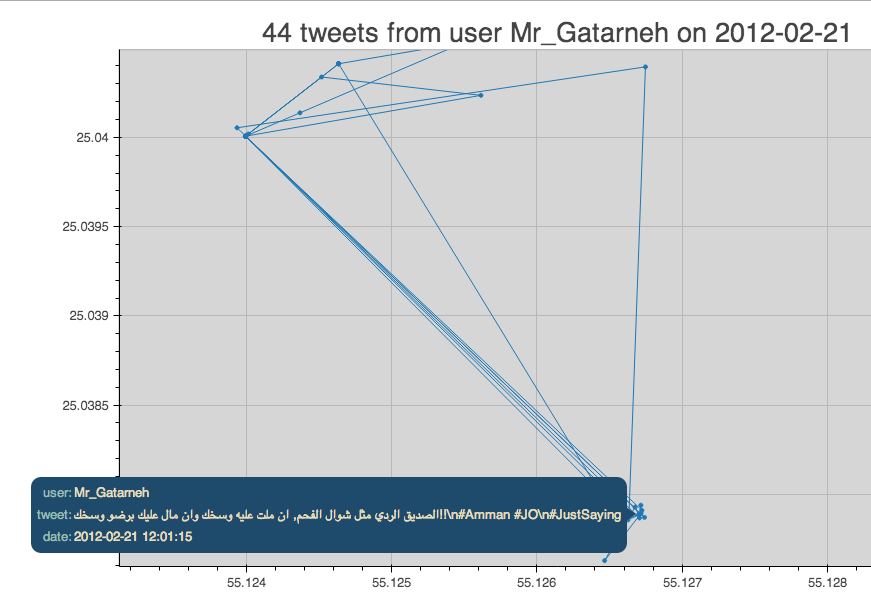

#XDATA Challenges

##Twitter Dataset

<table cellspacing="20" style="border:0px">
<tbody style="border:0px">
<tr style="border:0px">
<td style="border:0px">    </td>
<td style="border:0px">    </td>
<td style="border:0px">    </td>
<td style="border:0px">    </td>
</tr>
<tr style="border:0px">
<td style="border:0px">    </td>
<td style="border:0px">    </td>
<td style="border:0px">    </td>
<td style="border:0px">    </td>
</tbody></table>

The Twitter dataset was collected from February 2012 to May 2013. All collected tweets were sourced in Europe, the Middle East, Africa, Australia, and Asia. Some of the tweet records include high-fidelity geospatial information, resolved to lat-lon coordinates. In addition, translation, transliteration, sentiment, referenced tweets, mentioned user IDs, and other rich metadata are included in these records.

This demonstration contains the following examples:

#### Tweet Volume and Hashtag Analysis

*(youtube embed)*

> In this video we introduce you to using open-source Python libraries, Blaze and Bokeh, for analyzing Twitter data. By using publicly available data, we show you how to display data, such as tweet volume and top hashtag by date.

1. [Blaze-PySpark locally](tweet-volume-local-spark.ipynb)  
1. [Blaze-PySpark cluster](tweet-volume-cluster-spark.ipynb)
 
#### Geographic Visualization of Tweet Locations

*(youtube embed)*

> This video is follow up to the "Visualizing Twitter Data with Blaze and Bokeh Introduction" video. In this video, we plot tweets on a world map, show you how to filter by date and/or user, and how to display tweets on top of Google maps.

1. [Static world map with bokeh.plotting](tweet-worldmap-static-bcolz.ipynb#2.1-Static-world-map-with-bokeh.plotting)  
1. [Static world map with Glyphs](tweet-worldmap-static-bcolz.ipynb#2.2-Static-world-map-with-Glyphs)  
1. [World map - Tweets location](tweet-worldmap-location-bcolz.ipynb)  
1. [World map - Tweets User location](tweet-worldmap-user-bcolz.ipynb)  
1. [World map - Tweets User location with GMap](tweet-worldmap-gmap-bcolz.ipynb)  
1. [World map - Abstract Rendering](abstract_rendering)

## Employment Dataset

This dataset consists of employment opportunities posted from http://www.computrabajo.com affiliate sites, which primarily serve Latin and South American countries. Employment records were scraped from each site once per day from November 2012 to December 2013, and each record includes fields such as `posted date`, `location`, `salary`, etc.

As expected, many of the fields contain Spanish text. The `translated location` field is run through a geocoding service to estimate a rough latitude and longitude, although many of the records have locations that could not be translated or geocoded properly.

This demonstration contains the following examples:

#### [Dynamic Exploration of Large Datasets](./employment/)

*(youtube embed)*

> This video shows a demonstration of using Blaze and Bokeh to explore a large dataset. A 40 GB set of text files is pre-processed with Blaze, then we compute over this data with Blaze again and visualize it with Bokeh, providing interactive plots in the browser.

#### Data Migration with Blaze and Realtime Monitoring with Bokeh

*(youtube embed)*

> In this video, we use Blaze to migrate data from text files to SQL databases, with a couple plots in Bokeh that track the progress of the transfer, and use Blaze to query the database for latitude-longitude values, and a world map of the same.